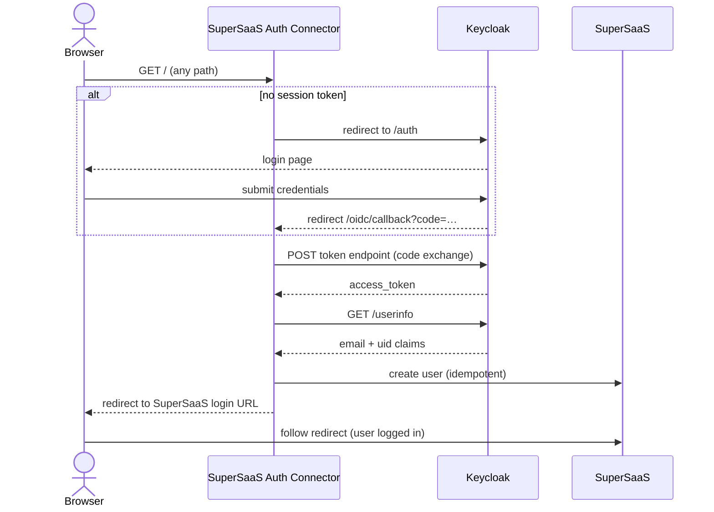

# Architecture

SuperSaaS Auth Connector is a small [Starlette](https://www.starlette.io/) ASGI application
that sits between [Keycloak](https://www.keycloak.org/) and
[SuperSaaS](https://www.supersaas.com/). It handles the OpenID Connect authorization-code
flow, provisions users in SuperSaaS on first login, and then forwards them directly into the
SuperSaaS scheduling interface.

## Request Flow



## Routes

| Path | Handler | Purpose |
|---|---|---|
| `/` | `catchall_page` | Catch-all; redirects to `/supersaas` |
| `/oidc/callback` | `catchall_page` | OIDC callback; middleware exchanges code for token, then redirects to `/supersaas` |
| `/supersaas` | `supersaas_redirect` | Creates user in SuperSaaS and redirects to the SuperSaaS login URL |
| `/logout` | `logout_redirect` | Front-channel logout via Keycloak logout URL |

## Middleware Stack

Middlewares are applied in reverse order (outermost first at runtime):

```
SessionMiddleware          – signs and verifies the session cookie
  └─ ContextMiddleware     – attaches RequestId and CorrelationId to the request context
       └─ _AuthenticationMiddleware  – OIDC token exchange and userinfo fetch
            └─ Starlette routing     – route handlers
```

### `_AuthenticationMiddleware`

This is the core of the application. For every incoming request it:

1. **Checks for an OIDC error** in the query string → redirects to `ERROR_REDIRECT_URL`.
2. **On `/oidc/callback`**: exchanges the `code` query parameter for an access token via
   Keycloak's token endpoint and stores it in the session.
3. **Fetches userinfo** from Keycloak using the access token, populating
   `request.state.user` with at minimum `email` and `uid` claims.
4. **On `/logout`**: skips userinfo fetch and lets the route handler redirect to Keycloak.
5. **No token**: redirects to Keycloak's authorization endpoint to start a new login.

## SuperSaaS Login URL

The `/supersaas` handler generates a signed SuperSaaS login URL using an MD5 checksum of
the account name, API token, and username:

```
https://www.supersaas.com/api/login
  ?account=<SUPERSAAS_ACCOUNT_NAME>
  &user[name]=<email>
  &checksum=<md5(account+token+email)>
```

!!! note
    The MD5 checksum is mandated by the
    [SuperSaaS login API specification](https://www.supersaas.com/info/dev/user_api#login).
    It is used solely as a lightweight API authentication token, not as a general-purpose
    cryptographic hash; the choice of algorithm is not within our control.

The `email` claim from Keycloak is used as the SuperSaaS username, and the `uid` claim
(with an `fk` suffix) is used as the SuperSaaS foreign key when the user is first created.

## Container Image

The application is packaged as a minimal container image and published to
[GitHub Packages](https://github.com/radiorabe/supersaas-auth-connector/pkgs/container/supersaasauthconnector).
The entry point runs [Uvicorn](https://www.uvicorn.org/) with the host set to `0.0.0.0` and
the port set by the `PORT` environment variable.

## Key Dependencies

| Package | Purpose |
|---|---|
| [`starlette`](https://www.starlette.io/) | ASGI framework, routing, middleware, sessions |
| [`uvicorn`](https://www.uvicorn.org/) | ASGI server |
| [`python-keycloak`](https://python-keycloak.readthedocs.io/) | Keycloak OIDC client (token exchange, userinfo) |
| [`supersaas-api-client`](https://pypi.org/project/supersaas-api-client/) | SuperSaaS REST API client |
| [`starlette-context`](https://starlette-context.readthedocs.io/) | Per-request context storage (request/correlation IDs) |
| [`itsdangerous`](https://itsdangerous.palletsprojects.com/) | Signed session cookie support |
